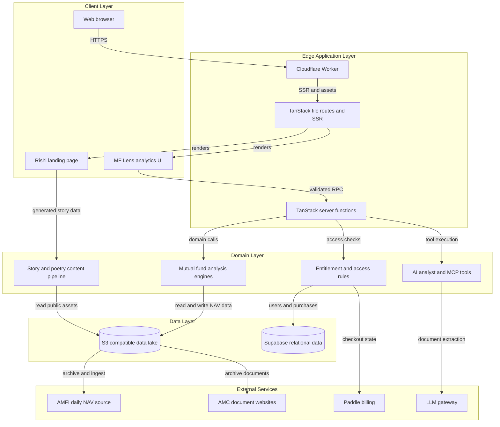
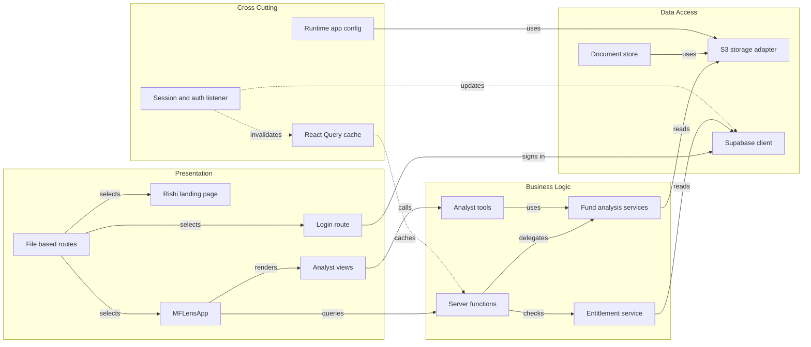

# Architecture Diagram

MF Lens is a TanStack Start application for mutual-fund research. The public landing page and analytics product share one Cloudflare Worker runtime while using Supabase for identity and account data and an S3-compatible lake for market and document data.

## Application Architecture

<!-- mermaid-checked: no \n, no em-dash/en-dash, no {} in labels, subgraphs are id["label"], arrows are -->|"label"|, all subgraphs closed by end, ids unique -->

### Technology Stack Summary

| Layer | Technology | Version | Purpose |
|---|---|---|---|
| Client | React | 19 | Landing page and analytics interface |
| Routing and SSR | TanStack Start and Router | 1.x | File routes, server rendering, navigation |
| Build | Vite and Nitro | 8.x and 3.x | Client and Cloudflare Worker bundles |
| Styling | Tailwind CSS and Radix UI | 4.x and 1.x | Responsive interface and primitives |
| Data fetching | TanStack Query | 5.x | Client cache and async server-function state |
| Validation | Zod | 4.x | Server-function input validation |
| Identity | Supabase Auth | 2.x | Google login, OTP login, sessions, bearer tokens |
| Relational data | Supabase Postgres | managed | Users, roles, purchases, subscriptions, AUM snapshots |
| Object storage | AWS S3 compatible bucket | runtime configured | NAV Parquet, raw feeds, documents, facts, config |
| Deployment | Cloudflare Workers | runtime configured | Edge SSR, API handlers, and public assets |
| Billing | Paddle | runtime configured | Checkout, subscriptions, and entitlement events |
| AI surface | Vercel AI SDK and MCP tools | 7.x and project SDK | Analyst responses and external agent access |

### Data Storage and External Services

The S3-compatible lake is the system of record for NAV history in Parquet, regulator archives, AMC documents, extracted facts, application configuration, and code snapshots. Supabase stores identity and account records, roles, purchases, subscriptions, and AUM snapshots. AMFI supplies daily NAV data, AMC sites supply public documents, Paddle supplies billing events, and the LLM gateway supports batched document extraction. These integrations are accessed from server-side modules and are not exposed to browser code.

### Key Architectural Decisions

- Paid access is enforced in server functions through entitlement checks; client-side locked UI is only a presentation layer.
- The application uses file-based routes and server functions to keep browser rendering, SSR, and server-only integrations in one deployable Worker.
- Editorial content is source-controlled as Word documents and local image folders, then converted into generated TypeScript during the build.

## Component Relationships

<!-- mermaid-checked: no \n, no em-dash/en-dash, no {} in labels, subgraphs are id["label"], arrows are -->|"label"|, all subgraphs closed by end, ids unique -->

### Component Inventory

| Component | Layer | Type | Responsibility |
|---|---|---|---|
| `src/routes/` | Presentation | TanStack routes | Public pages, analytics entry points, API routes, and SSR boundaries |
| `RishiLandingPage` | Presentation | React component | Public notebook landing page and generated editorial posts |
| `MFLensApp` | Presentation | React component | Interactive fund analysis shell, controls, charts, modules, and access UI |
| `login.tsx` | Presentation | Route component | Google OAuth and mobile OTP sign-in flow |
| `src/lib/*.functions.ts` | Business Logic | Server functions | Validated browser-to-server operations |
| `mf.server.ts` | Business Logic | Domain service | NAV loading, sideways-window detection, fund analysis, ratios, and ranking |
| `mf-multi.server.ts` | Business Logic | Domain service | Combined windows and dip analysis |
| `entitlement.server.ts` | Business Logic | Access service | Viewer identity, open or subscription edition, and Pro checks |
| `agent-tools.server.ts` | Business Logic | AI tool registry | Category, window, analysis, holdings, profile, and comparison tools |
| `s3.server.ts` | Data Access | Storage adapter | Signed AWS S3 requests and connector fallback |
| `docs-store.server.ts` | Data Access | Document service | AMC document ingestion, indexing, signed download URLs, and status |
| `supabase/client.ts` | Data Access | Client adapter | Browser session persistence and Supabase API access |
| `auth-attacher.ts` | Cross Cutting | Function middleware | Adds the current Supabase bearer token to server-function calls |
| `__root.tsx` auth listener | Cross Cutting | Session listener | Reacts to sign-in, sign-out, and user updates across routes |
| `@tanstack/react-query` | Cross Cutting | Query cache | Caches analysis, window, profile, and entitlement requests |
| `app-config.server.ts` | Cross Cutting | Configuration service | Reads and writes runtime settings from the data lake |
