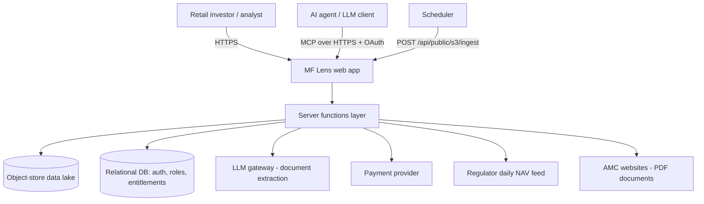
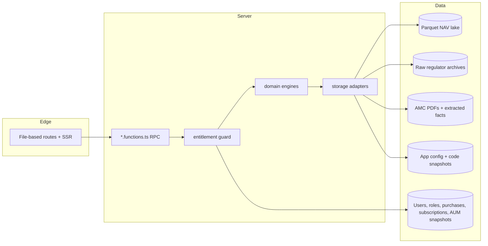
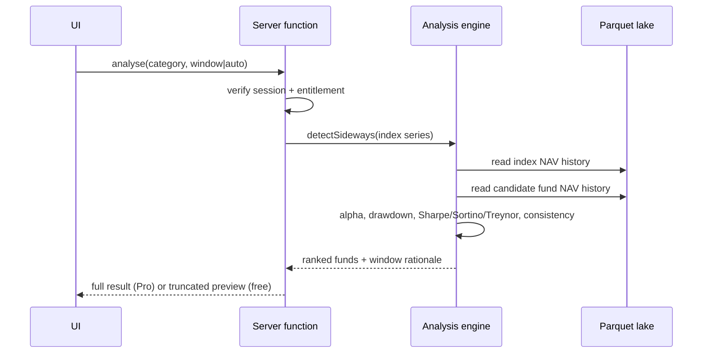

# MF Lens — System Overview (tool & environment agnostic)

MF Lens is a mutual-fund analytics platform that finds **sideways (range-bound) phases**
of an equity index and ranks the funds in a category that performed best during those
phases. It ships an in-house **S3 data lake** (NAV history in Parquet, raw regulator
downloads, AMC documents, app config/code), a **server-function API**, an **MCP agent
surface**, and a **subscription paywall**.

This documentation set is deliberately written without naming any single vendor as a
requirement. Every component is described by its *role* first, with the current concrete
implementation given as "today's binding". Any equivalent technology can be substituted.

## Documents

| Audience | File |
|---|---|
| CIO / business + risk | [roles/cio.md](roles/cio.md) |
| CTO / engineering strategy | [roles/cto.md](roles/cto.md) |
| Solution / data architect | [roles/architect.md](roles/architect.md) |
| Network / platform engineer | [roles/network-engineer.md](roles/network-engineer.md) |
| Developer | [roles/developer.md](roles/developer.md) |
| Tester / QA | [roles/tester.md](roles/tester.md) |
| Release manager / SRE | [roles/release-manager.md](roles/release-manager.md) |
| All — third-party surface | [external-dependencies.md](external-dependencies.md) |
| AI agents | [ai-skill.md](ai-skill.md) |

## Context diagram

## Runtime layers

## Core domain flow

## Non-negotiable invariants

1. Entitlement is enforced **server-side**; the client never decides what is paid.
2. Roles live in a dedicated `user_roles` table, never on a profile row.
3. The lake is the system of record for NAV; public feeds are top-up/fallback only.
4. Ingest endpoints are public by URL but authenticated by a shared secret header.
5. No secret is ever read at module scope — only inside a request handler.
