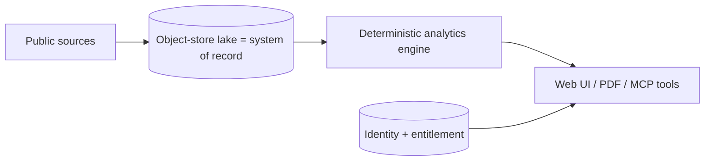

# AI Skill — Operating and Extending MF Lens

Use this file as an agent skill. It is environment and tool agnostic: it states intent,
invariants and procedures, not vendor commands.

## Skill identity

**Name**: mf-lens-operator
**Purpose**: safely extend, scale, operate and troubleshoot a mutual-fund analytics platform
built on an object-store Parquet lake with edge-hosted server RPC.
**Read first**: `00-overview.md`, then the role file matching the task, then
`external-dependencies.md`.

## Mental model

Everything else is an adapter. If a change does not fit that picture, it is probably in the
wrong layer.

## Invariants — never violate

1. Entitlement and role checks happen on the server; truncate payloads there.
2. Roles live in a dedicated roles table, checked via a security-definer function.
3. Every new public table ships with GRANTs, RLS enabled and policies in the same migration.
4. Secrets are read inside request handlers only.
5. Every outbound call has a timeout, bounded retries and a defined degradation path.
6. Never display a number the platform cannot trace to a source; say "unavailable" instead.
7. The lake is authoritative for NAV; public feeds are top-up/fallback.
8. Ingest jobs must remain idempotent.
9. Server-function files contain only imports, types and exported declarations.
10. Do not introduce server-side dependencies that need native binaries or subprocesses.

## Task playbooks

### Add a new fund category
1. Add the category key to the catalog and to `categories` in app config.
2. Add its benchmark proxy under the index partition; run the index backfill.
3. Run `backfill` for the category and confirm the manifest object exists.
4. Add category-specific ranking weights with a written rationale.
5. Extend the demo surface and the documentation table.

### Add a metric
Compute in the engine → add per-category weight → extend the result type → render column and
its plain-language definition → add to the PDF → update `architect.md`.

### Make it faster
1. Measure: which partitions are read per request.
2. Precompute nightly leaderboards per category into the lake; serve those for default views.
3. Keep the live engine for custom date ranges.
4. Add a shared cache tier before adding compute.

### Make it more robust
1. Add a fallback for any single-source read.
2. Make every job idempotent and chunked by a `limit` parameter.
3. Log each job run as an object under `app/logs/ingest/<job>/`.
4. Add freshness alerting rather than uptime alerting — stale data is the real failure.
5. Prefer serving stale-with-notice over an error page.

### Diagnose "no data for a category"
Manifest present? → Parquet objects present for schemes? → last successful ingest log? →
screening filters (age > 3y, AUM band, coverage ≥ 80%) too strict for this universe?

### Diagnose "user paid but has no access"
Purchase/subscription row present? → webhook delivered and signature valid? → entitlement
resolver reading the right identity? → replay the webhook.

## Guardrails for autonomous changes

Allowed without asking: UI/presentation, documentation, new tests, new pure metrics behind
existing gating, adding fallbacks and logging.

Ask first: pricing or plan changes, entitlement logic, schema migrations, deleting or
rewriting lake objects, adding a new paid vendor, changing the sideways rule thresholds
(these define the product's core claim).

## Output expectations

When acting on this skill, state: what changed, which invariant it touches, how it degrades
under failure, and what to verify in preview.
