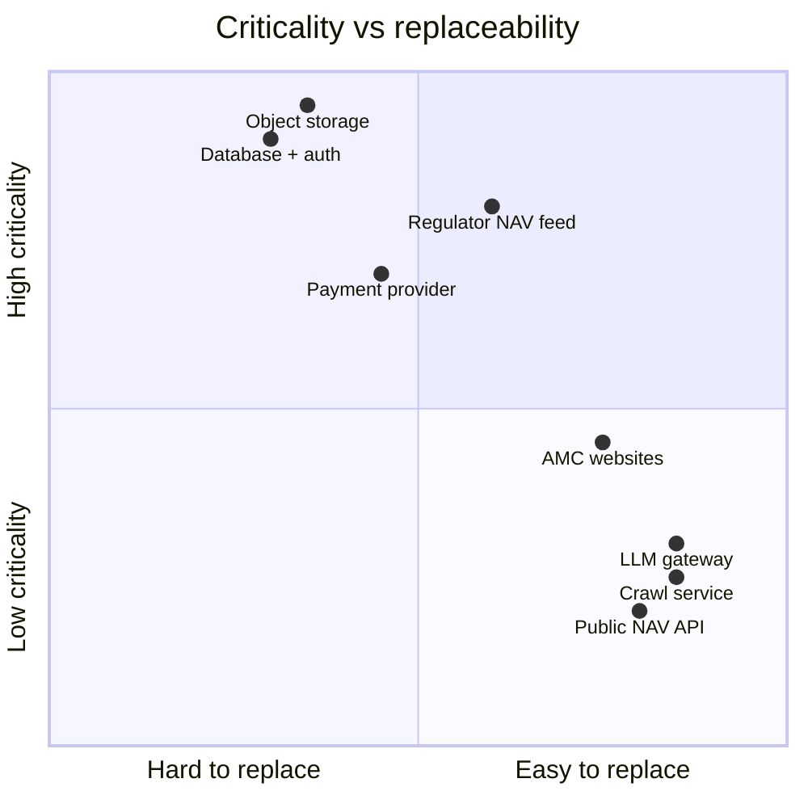

# External Dependencies — MF Lens

Everything the platform touches outside its own compute. Each entry lists what it is used
for, the failure behaviour, and a substitution path, so no dependency is load-bearing in a
way the team cannot reverse.

## 1. Data sources

### 1.1 Regulator daily NAV file (AMFI `NAVAll.txt`)
- **Used for**: the single daily top-up of every scheme's NAV; archived immutably under
  `nav/raw/amfi/dt=<date>/`.
- **Shape**: plain text, pipe-delimited, one row per scheme, published once per business day.
- **Criticality**: high — but only for freshness. History already lives in the lake.
- **Failure mode**: file unpublished or fetch times out → job logs a failure, app serves
  yesterday's data unchanged.
- **Limits**: no API key, no documented rate limit; fetch once per day, never per request.
- **Substitute**: any exchange/AMC NAV feed with scheme code + date + NAV.

### 1.2 Public NAV/metadata API (fallback)
- **Used for**: schemes not yet migrated into the lake, and scheme metadata lookups.
- **Criticality**: low — fallback only.
- **Failure mode**: timeout/502 → retry with backoff → stale cache → the scheme is skipped.
- **Substitute**: remove entirely once lake coverage is complete.

### 1.3 AMC websites (20+ fund houses)
- **Used for**: discovering and downloading factsheets, portfolio disclosures, SIDs.
- **Criticality**: medium — powers manager, AUM and holdings enrichment.
- **Failure mode**: several AMCs block automated fetches; those houses are imported manually
  through the admin console. Missing documents degrade enrichment, never the ranking.
- **Legal note**: only publicly published disclosure documents are fetched; respect
  robots/ToS and keep crawl rates low.

### 1.4 Public AUM/portfolio APIs
- **Used for**: AUM figures and quarterly flow deltas when a factsheet is not yet parsed.
- **Criticality**: low — the in-house extracted facts take priority.

## 2. Platform services

### 2.1 Object storage (S3-compatible)
- **Used for**: the entire data plane — Parquet NAV, raw archives, documents, extracted
  facts, app config, ingest logs, code/doc snapshots.
- **Access model**: list/head through a proxy gateway; get/put through short-lived
  pre-signed URLs (bodies never traverse the gateway).
- **Criticality**: critical — this is the system of record.
- **Failure mode**: signing endpoint 5xx is retried with backoff; sustained outage means
  analysis cannot run. Mitigate with bucket versioning and replication.
- **Substitute**: any S3-API store; only `s3.server.ts` changes.

### 2.2 Relational database (Postgres with row-level security)
- **Used for**: users, `user_roles`, purchases, subscriptions, AUM snapshots.
- **Criticality**: critical for auth/entitlement; the public demo still renders without it.
- **Contract**: every public table has explicit GRANTs, RLS enabled and policies; role checks
  go through a security-definer function.

### 2.3 Authentication provider (OAuth/OIDC + OTP)
- **Used for**: Google sign-in and mobile/email OTP; issues the bearer token attached to
  server-function calls.
- **Failure mode**: sign-in unavailable → demo surface still works; paid surfaces are closed.

### 2.4 LLM gateway
- **Used for**: structured extraction of AUM, fund manager, tenure and benchmark from PDF
  text (documents are parsed to text locally first).
- **Criticality**: low at runtime — extraction is a batch job, results are cached in the lake.
- **Cost control**: batched with a `limit` parameter, per-house caching, no per-request calls.
- **Substitute**: any chat-completions endpoint, or deterministic parsing rules.

### 2.5 Crawl/scrape service
- **Used for**: discovering document links on AMC pages and, as fallback, holdings pages.
- **Criticality**: low — plain fetch is tried first; failures degrade to manual import.

### 2.6 Payment provider (merchant of record)
- **Used for**: annual and 3-year subscription checkout, price lookup, webhooks.
- **Integration**: hosted checkout on the client; signature-verified webhook server-side
  drives all entitlement state. Refund/adjustment events revoke access immediately.
- **Criticality**: high for revenue, zero for analytics.
- **Failure mode**: price API degraded → cached prices served; webhook failure → retry from
  the provider, or manual replay.

### 2.7 Agent protocol surface (MCP)
- **Used for**: exposing category listing, sideways windows, analysis, fund/benchmark
  comparison, holdings and manager tools to AI clients, protected by OAuth.
- **Criticality**: low — an optional distribution channel.

## 3. Build / runtime libraries

| Library | Purpose | Replaceability |
|---|---|---|
| React 19 + TanStack Start/Router/Query | UI, routing, SSR, data fetching | framework-level, high effort |
| Vite | build/dev | swap for any bundler |
| Tailwind CSS + Radix primitives | design system | high effort, cosmetic only |
| `hyparquet` / `hyparquet-writer` | Parquet read/write in an edge runtime | swap for any Parquet lib with WASM/JS support |
| `unpdf` | PDF → text before extraction | any pure-JS PDF text extractor |
| `jspdf` + `jspdf-autotable` | client-side report generation | server-side renderer |
| `recharts` | charts | any charting lib |
| `zod` | input validation on every server function | any schema validator |
| `date-fns` | date math | native Intl/Temporal |

Runtime constraint: the server runs in an edge worker runtime. Packages requiring native
binaries, subprocesses, or a real OS filesystem (image processors, headless browsers,
`child_process`) cannot be used server-side.

## 4. Secrets and configuration

| Name | Purpose | Scope |
|---|---|---|
| Object-store connection key | authenticate storage gateway calls | server |
| Platform API key | gateway authorization | server |
| `INGEST_SECRET` | authenticate scheduled ingest calls | server + scheduler |
| Payment webhook/API credentials | checkout + webhook verification | server |
| Database URL + publishable key | data access | server + client (publishable only) |
| Crawler API key | document discovery | server |

Rules: server secrets are read inside handlers only; publishable keys are the only values
allowed in client code; no secret is committed to the repository.

## 5. Dependency risk summary

## 6. Cold-start reconstruction

From the bucket plus the secret set, the platform can be rebuilt with no other vendor state:

1. Deploy the code snapshot from `app/code/<version>/`.
2. Load configuration from `app/config/app.json`.
3. NAV history is already present under `nav/parquet/**` (or rebuild from `nav/raw/**`).
4. Documents and extracted facts are under `documents/**`.
5. Recreate database schema (users, roles, purchases, subscriptions, AUM snapshots) and
   re-link payment provider webhooks.
