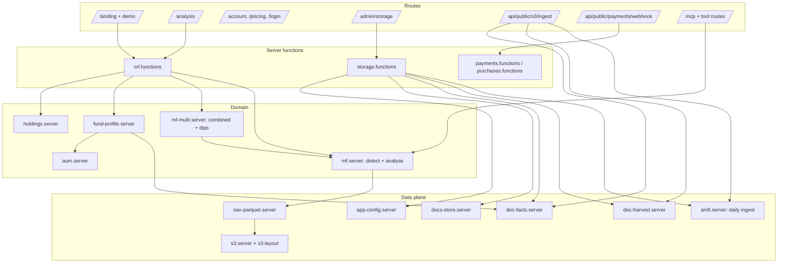
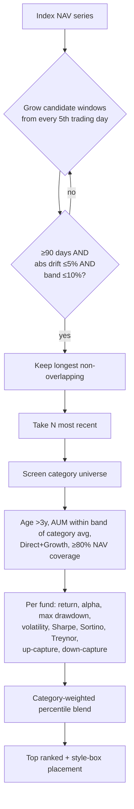
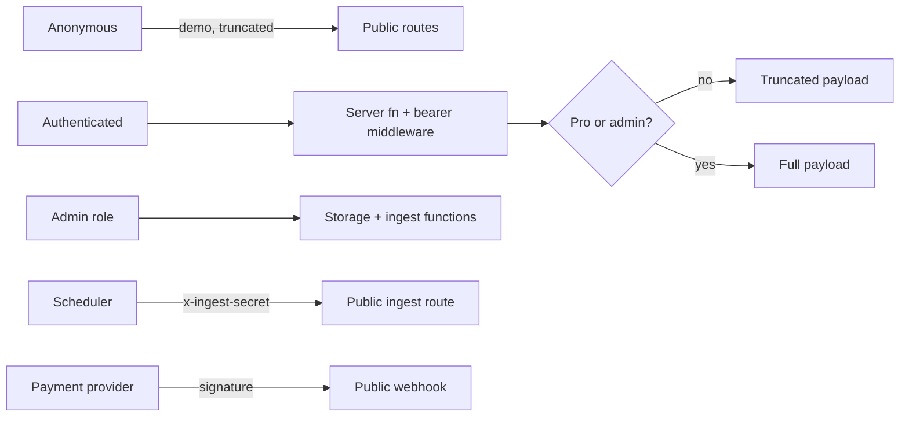

# Architect Guide — MF Lens

## Component map



## Data lake layout (canonical, `s3-layout.ts`)

```text
nav/parquet/category=<cat>/scheme_code=<code>/nav.parquet   full NAV history, columnar
nav/raw/amfi/dt=<YYYY-MM-DD>/NAVAll.txt                     immutable daily regulator file
nav/_manifest/<category>.json                               scheme inventory + coverage
documents/<fund_house>/<doc_type>/<file>.pdf                AMC source documents
documents/_index.json                                       document catalogue
documents/_facts/<fund_house>.json                          LLM-extracted structured facts
app/config/<name>.json                                      runtime configuration
app/logs/ingest/<job>/<timestamp>.json                      ingest run logs
app/code/<version>/...                                      code + config snapshots
app/docs/...                                                this documentation set
```

Partitioning rationale: category is the query predicate for every screen; scheme_code is
the join key. One file per scheme keeps appends cheap and avoids compaction.

## Category = partition key

`large | mid | small | multi | flexi | hybrid | index` (index holds benchmark proxies).

## Analysis pipeline



## Storage decision record

| Decision | Rationale | Consequence |
|---|---|---|
| Parquet over row DB for NAV | ~10× smaller, column pruning, portable to any query engine | Needs a reader lib in the runtime |
| Object store as system of record | Vendor-portable, cheap, versionable | Eventual consistency on list operations |
| Relational DB only for identity/entitlement/state | Keeps RLS surface tiny and auditable | Two stores to operate |
| Signed URLs for object get/put | Gateway does not proxy bodies; avoids memory pressure | Clients need clock-valid short-lived URLs |
| In-memory caches, TTL-bounded | Zero infra, adequate at current traffic | Cold start recompute; move to shared cache at scale |

## Security architecture



Rules: roles in `user_roles` + security-definer `has_role`; RLS on every public table with
explicit GRANTs; privileged DB client only after caller verification; secrets read inside
handlers only.

## Extension points

- **New category**: add to the catalog + config `categories`, run backfill, done.
- **New benchmark**: add an index proxy under `category=index`.
- **New document type**: extend `DOC_TYPES`, harvest patterns, and the extraction schema.
- **New agent tool**: add a module under the MCP tools folder; it inherits OAuth.
- **New metric**: compute in the engine, add a weight per category, surface in the leaderboard.
