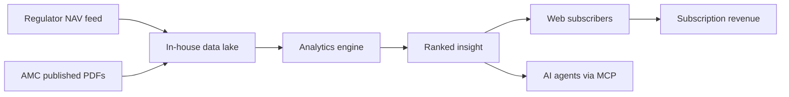

# CIO Brief — MF Lens

## What the platform does

Identifies periods when an equity index went **sideways** (no meaningful net drift, tight
high-low band, sustained duration) and shows which funds in a chosen category actually
created value in exactly those periods. Sideways phases are where fund selection matters
most — trending markets flatter every fund.

## Value chain

## Business capabilities

| Capability | Status | Notes |
|---|---|---|
| Sideways-phase detection per index | Live | ≥90 days, drift within ±5%, band within 10% |
| Category ranking (large/mid/small/multi/flexi/hybrid) | Live | Category-specific ratio weights |
| Combined ranking across last 3 phases | Live | Rewards repeatability, penalises one-off winners |
| Dip radar (5–10% off 1-year peak) | Live | Entry-timing shortlist |
| Fund manager & AUM facts from official documents | Live | Extracted from AMC PDFs held in-house |
| PDF client report | Live | Includes regulatory disclaimer |
| Agent access (MCP) | Live | OAuth-protected tool surface |
| Free preview → paid conversion | Live | Annual and 3-year plans |

## Risk register

| Risk | Impact | Control |
|---|---|---|
| Third-party data outage | Analysis stale | Lake-first reads; app functions on last good snapshot |
| AMC site blocks crawling | Missing documents | Manual URL import path in admin console |
| Mis-stated performance | Regulatory/reputational | Every metric derived from official NAV; disclaimer on UI + PDF |
| Paywall bypass | Revenue leakage | Server-side entitlement truncation, audited |
| Vendor lock-in | Cost/agility | All vendors abstracted behind adapters (see external-dependencies.md) |
| Key personnel | Continuity | This documentation set is the runbook; also stored in the lake |

## Compliance posture

- Investment content carries a standing disclaimer: past performance is not indicative of
  future results; the product is analytical, not advisory.
- Source data is public regulator/AMC disclosure — no proprietary redistribution claims.
- Personal data is limited to authentication identity and purchase records.
- Admin actions (ingest, document import, config change) are role-gated and logged to the lake.

## Cost drivers

1. Object storage + egress (dominant at scale; Parquet keeps it small).
2. LLM calls for document fact extraction (batched, cached, per-house).
3. Crawl/scrape credits for AMC discovery.
4. Compute is request-scoped and scales to zero between requests.

## KPIs worth tracking

- Coverage: schemes in the lake / schemes in category universe.
- Freshness: hours since last successful daily NAV ingest (target < 24h).
- Extraction yield: funds with in-house manager+AUM facts / funds ranked.
- Conversion: free preview sessions → paid.
- Reliability: successful scheduled ingest runs per 30 days.
