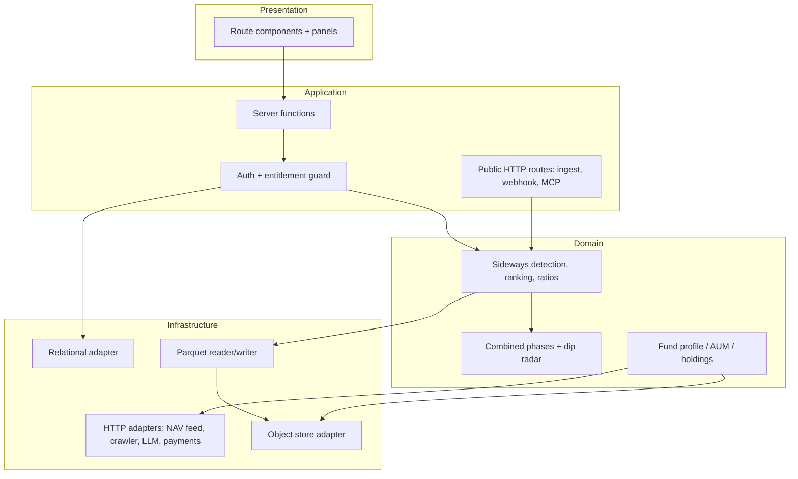

# CTO Brief — MF Lens

## Architecture in one line

A full-stack React app with typed server RPC at the edge, an object-store Parquet lake as
the system of record, a relational DB only for identity/entitlement/state, and pluggable
outbound adapters for NAV, documents, LLM and payments.

## Layering

## Technology bindings (swappable)

| Role | Today | Alternatives |
|---|---|---|
| UI + SSR framework | TanStack Start (React 19, Vite) | Next.js, Remix |
| Server runtime | Edge worker runtime | Node container, Lambda |
| Object store | S3-compatible bucket via gateway | any S3 API, GCS, Azure Blob |
| Columnar format | Parquet (`hyparquet`) | Delta/Iceberg on the same layout |
| Relational DB | Postgres with row-level security | any Postgres |
| Auth | OIDC/OAuth + OTP provider | Auth0, Cognito, Keycloak |
| LLM | Gateway-fronted model | any chat-completions endpoint |
| Payments | Merchant-of-record provider | Stripe, Razorpay |
| Agent protocol | MCP over HTTPS | OpenAPI tool schema |

## Scaling model

- **Stateless compute**: horizontal scaling is free; there is no session affinity.
- **Read path**: Parquet per `category/scheme_code`, so a query touches only the partitions
  it needs. Add a memoised in-process cache; add a shared cache tier when hit rate matters.
- **Write path**: one daily append job merges new rows per scheme; safe to run repeatedly
  (idempotent by date key).
- **Heavy jobs** (document harvest, LLM extraction) are batch endpoints with a `limit`
  parameter so a scheduler can walk the backlog in bounded chunks.

Scaling milestones:

1. **10k users** — current shape, add CDN caching for the demo/landing payloads.
2. **100k users** — precompute nightly leaderboards per category into the lake; serve
   analysis reads from precomputed JSON, keep the engine for custom date ranges.
3. **1M users / partner API** — extract the engine into a separate service with a queue,
   introduce a query engine over the Parquet lake, add per-tenant rate limiting.

## Robustness principles enforced in code

- Every outbound call: explicit timeout, bounded retries with exponential backoff,
  stale-cache fallback rather than a hard failure.
- Degradation order for NAV: lake → public feed → cached previous response → clear error.
- Never fabricate data: if holdings or manager facts cannot be sourced, the UI says so.
- Fail closed on entitlement, fail open on enrichment.

## Technical debt / roadmap

- No automated test suite yet — highest-value next investment (see tester.md).
- No queue: long jobs rely on scheduler chunking.
- Analytics results are computed per request; precomputation is the next perf step.
- Observability is log-based; add structured metrics and an ingest freshness alert.
