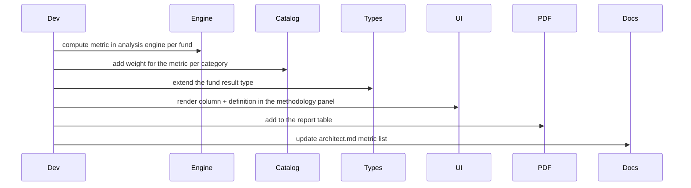

# Developer Guide — MF Lens

## Repository map

```text
src/routes/            file-based routes; api/public/* are unauthenticated by URL
src/components/        UI panels (leaderboard, style grid, holdings, methodology, charts)
src/lib/*.functions.ts client-callable typed server RPC (the only server entry for the UI)
src/lib/*.server.ts    server-only modules; never imported by client code directly
src/lib/mcp/tools/     agent tool implementations
docs/                  this documentation set
```

## Boundary rules (breaking these breaks the build)

1. UI imports `*.functions.ts`; `*.functions.ts` imports `*.server.ts`. Never skip a level.
2. A file declaring server functions must contain only imports, types and the exported
   declarations — put helpers in a separate module.
3. Read secrets **inside** handlers, never at module scope.
4. Never call an auth-protected server function from a public route loader (prerender has
   no session); call it from the component instead.
5. Browser-only libraries must be dynamically imported after hydration.

## Adding a metric end to end



## Adding a data source

1. Write an adapter in `src/lib/<source>.server.ts` with timeout + retry + cache.
2. Persist normalised output into the lake under an existing prefix in `s3-layout.ts`
   (or add a new prefix there — never hard-code paths elsewhere).
3. Expose an admin trigger in `storage.functions.ts` and a job branch in the ingest route.
4. Make it fail soft: the app must render without the new source.

## Working with the lake

```ts
// read
const rows = await readNavParquet(category, schemeCode);
// write (append-merge, idempotent by date)
await writeNavParquet(category, schemeCode, mergedRows);
// arbitrary object
await s3PutJSON(S3_PATHS.config("app"), cfg);
const cfg = await s3GetJSON<AppConfig>(S3_PATHS.config("app"));
```

Get/put always go through a signed URL; list/head go through the gateway proxy. Do not
attempt to stream large object bodies through the gateway.

## Error handling contract

```ts
const res = await fetch(url, { signal: AbortSignal.timeout(45_000) });
if (!res.ok) {
  const body = await res.text();              // keep provider detail
  throw new Error(`Upstream ${res.status}: ${body.slice(0, 300)}`);
}
```

Then decide the degradation: serve stale cache, fall back to the secondary source, or
return a typed "unavailable" result the UI can render honestly. Never invent numbers.

## Entitlement pattern

```ts
export const analyse = createServerFn({ method: "POST" })
  .inputValidator(schema.parse)
  .handler(async ({ data }) => {
    const access = await resolveAccess();      // session + role + purchase state
    const full = await runAnalysis(data);
    return access.pro ? full : truncate(full); // truncation happens on the server
  });
```

## Local commands

```sh
npm run dev      # dev server
npm run build    # production build (must pass before release)
npm run lint
npm run format
```

## Definition of done

- Types clean, build green, lint clean.
- New route has its own `head()` metadata (title, description, og/twitter).
- New paid surface is truncated server-side for free users.
- New table has GRANTs + RLS + policies in the same migration.
- Docs in this folder updated, and the snapshot re-uploaded to the lake.
