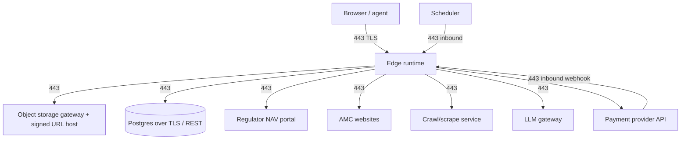

# Network / Platform Engineer Guide — MF Lens

## Traffic map

All traffic is HTTPS on 443. There are no inbound ports other than the web listener, and
no persistent outbound connections (no raw TCP, no VPN, no fixed egress IP requirement).

## Inbound endpoints

| Path | Auth | Caller | Notes |
|---|---|---|---|
| `/` `/analysis` `/pricing` `/login` | none / session | users | SSR + client |
| `/account` `/admin/storage` | session (+admin role) | users | admin console is role-gated |
| `/_serverFn/*` | session bearer where required | app | typed RPC |
| `/api/public/s3/ingest` | `x-ingest-secret` header | scheduler | GET/POST, job param |
| `/api/public/payments/webhook` | provider signature | payment provider | verify before processing |
| `/mcp`, `/.mcp/*`, `/.well-known/oauth-protected-resource` | OAuth | AI agents | discovery + tools |

## Outbound egress allow-list (by purpose)

| Purpose | Destination class | Protocol | Timeout budget |
|---|---|---|---|
| Object list/head | storage gateway host | HTTPS GET/HEAD | 20–30s |
| Object get/put | signed-URL host (storage region endpoint) | HTTPS GET/PUT | 120s |
| Daily NAV file | regulator portal | HTTPS GET | 45s |
| Fund metadata fallback | public NAV API | HTTPS GET | 45s |
| AMC documents | many AMC domains | HTTPS GET | 60s |
| Crawl service | crawler API host | HTTPS POST | 60s |
| LLM extraction | model gateway host | HTTPS POST | 120s |
| Payments | provider API host | HTTPS GET/POST | 30s |
| Auth/DB | database host | HTTPS | 15s |

If egress filtering is required, allow-list by hostname; the AMC set is broad and changes,
so treat document harvesting as a lower-trust, best-effort path.

## Resilience patterns already in place

- Bounded timeouts on **every** outbound call (`AbortSignal.timeout`).
- Exponential backoff with jittered retries for 5xx/429 on storage signing and NAV fetches.
- In-flight request de-duplication so a thundering herd hits upstream once.
- Stale-cache fallback: last good response served rather than an error page.
- Idempotent ingest: re-running a day is a no-op.

## Scheduling

| Job | Suggested cadence | Call |
|---|---|---|
| `daily-nav` | daily, after regulator publish window (config `dailyIngestHourIST`) | `POST /api/public/s3/ingest?job=daily-nav` |
| `backfill` | on demand per category | `?job=backfill&category=large&limit=40` |
| `backfill-index` | monthly | `?job=backfill-index` |
| `harvest-docs` | weekly, chunked | `?job=harvest-docs&limit=4` |
| `extract-doc-facts` | weekly, after harvest | `?job=extract-doc-facts&limit=6` |
| `migrate` | one-off / recovery | `?job=migrate&limit=60` |

Always send `x-ingest-secret`. Give each job a distinct schedule slot; they are not designed
to run concurrently against the same category.

## Storage-side configuration

- Bucket CORS must allow the app origin for `GET` and `PUT` if any browser-direct signed-URL
  transfer is used.
- Lifecycle policy suggestion: keep `nav/raw/**` for 400 days, transition to cold storage
  after 90 days; keep `nav/parquet/**` and `documents/**` hot.
- Versioning on the bucket is the cheapest disaster-recovery control for the lake.

## Observability checklist

1. Ingest freshness alert: no successful `daily-nav` log object in the last 30 hours.
2. Error-rate alert on 5xx from `/_serverFn/*`.
3. Webhook failure alert: any non-2xx on the payments webhook.
4. Storage 4xx/5xx rate from the signing endpoint.
5. Budget alert on LLM and crawler spend.
