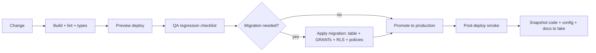
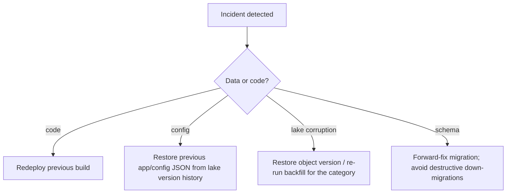

# Release Manager / SRE Guide — MF Lens

## Environments

| Environment | Purpose | Data | Payments |
|---|---|---|---|
| Development | feature work | lake read-only or scratch prefix | sandbox |
| Preview | review + QA of a change | shared lake, separate config key | sandbox |
| Production | live users | canonical lake prefixes | live |

Environment differences must live in configuration (`app/config/*.json` and secrets), never
in code branches.

## Release flow

## Pre-release gate

- [ ] Production build succeeds.
- [ ] Regression checklist in `tester.md` passed on preview.
- [ ] Any new table has GRANTs, RLS enabled, and policies in the same migration.
- [ ] Any new secret exists in the target environment before deploy.
- [ ] Scheduler jobs unchanged, or the schedule updated in the same window.
- [ ] Documentation updated and re-snapshotted.

## Post-deploy smoke (5 minutes)

1. Landing page renders with a live demo window.
2. `/analysis` returns a ranked table for two categories.
3. Sign-in works for one method.
4. `/pricing` loads prices from the provider.
5. Ingest endpoint returns 401 without the secret and 200 with it (`job=daily-nav` is safe
   to re-run — it is idempotent).
6. Admin storage overview loads object counts.

## Rollback

Code rollback is always safe: the app is stateless. Lake objects are recoverable through
bucket versioning; NAV Parquet can always be rebuilt by re-running `backfill` and
`daily-nav` because raw regulator files are archived immutably.

## Change classes and risk

| Class | Example | Approval | Window |
|---|---|---|---|
| Standard | UI copy, styling | self | any |
| Normal | new metric, new panel | peer review | business hours |
| High | pricing, entitlement, webhook, migration | CTO sign-off | low-traffic window |
| Emergency | security fix | post-hoc review | immediate |

## Operational runbook

**Ingest missed / stale data** — re-run `daily-nav`; if the regulator file is unpublished,
wait and re-run. Check `app/logs/ingest/daily-nav/` for the last run object.

**Category shows no funds** — manifest missing or empty: run `backfill&category=<cat>`.

**Benchmarks missing** — run `backfill-index`.

**Pricing page errors** — provider API degraded; the cache serves stale prices. Confirm
exactly one active price per plan on the provider side.

**Paid user without access** — check the purchase/subscription row, then replay the
provider webhook for that transaction.

**Extraction failures for an AMC** — the site blocks automation; use the manual document
import in the admin console.

## Continuity

- Bucket versioning + cross-region replication is the DR baseline; RPO = last daily ingest,
  RTO = redeploy time (minutes) since compute is stateless.
- Code, configuration and this documentation set are snapshotted into the lake under
  `app/code/<version>/` and `app/docs/`, so the platform can be reconstructed from the
  bucket alone plus the secret set.
