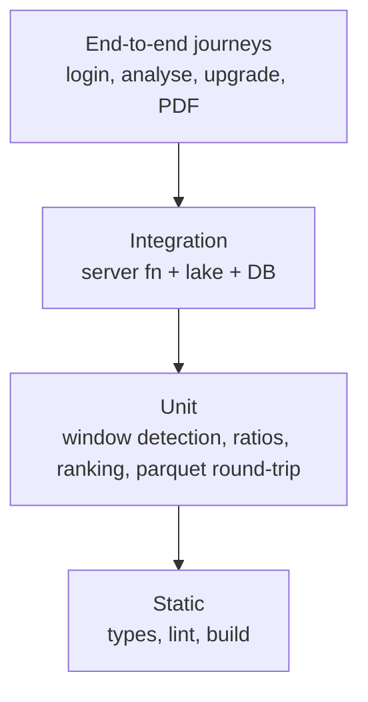
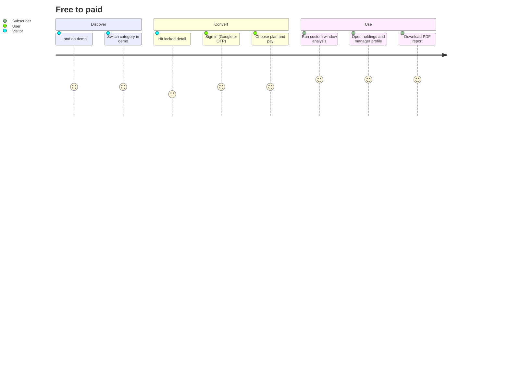

# Tester / QA Guide — MF Lens

## Test pyramid

## Unit test targets (pure, deterministic — highest value first)

| Function | Property to assert |
|---|---|
| Sideways detection | A synthetic flat series yields exactly one window; a trending series yields none |
| Sideways detection | Boundary: 89 days rejected, 90 accepted; drift 5.01% rejected |
| Max drawdown | Known series → known value; monotonic series → 0 |
| Sharpe / Sortino / Treynor | Zero-volatility input does not divide by zero |
| Alpha | Fund equal to index → alpha 0 |
| Ranking blend | Weight vector sums to 1 per category; reordering inputs does not change ranks |
| Combined ranking | A fund present in 1 of 3 phases ranks below an equal-scoring fund present in 3 |
| Dip radar | Fund at exactly 5% and 10% off peak is included; 4.9% and 10.1% excluded |
| Parquet store | write → read round-trip preserves dates and NAV precision |
| Daily merge | Re-running the same day adds zero rows |

## Integration checks

1. **Lake-first read**: with the lake populated, no call is made to the public NAV feed.
2. **Fallback**: simulate lake miss → public feed used → result still returned.
3. **Ingest auth**: request without `x-ingest-secret` → 401; wrong secret → 401.
4. **Webhook**: invalid signature → 401 and no state change.
5. **Entitlement**: same request as anonymous / free / pro / admin returns
   truncated / truncated / full / full payloads respectively.
6. **Admin gating**: non-admin session hitting storage functions is rejected server-side.

## End-to-end journeys

Also cover: combined-phases view, dip radar, theme toggle persistence, admin data-lake
console (overview loads, backfill runs, document import), MCP tool listing and invocation.

## Payment testing

- Use the provider's sandbox/test mode; the app shows a test-mode banner when active.
- Test cards from the provider's documentation only — never real cards.
- Verify each webhook event class: completed, subscription created/updated/cancelled,
  refund/adjustment → access revoked immediately.
- Replay the same webhook twice: state must be identical (idempotency).

## Data-quality assertions

- Every ranked fund has NAV coverage ≥80% of the window.
- No ranked fund is younger than 3 years.
- AUM shown is either sourced or explicitly marked unavailable — never zero-as-unknown.
- Holdings weights sum to a plausible total; if the source is unusable, the panel says so.
- Every displayed number can be traced to the lake or a named public source.

## Non-functional

| Aspect | Target |
|---|---|
| First analysis response (warm) | < 3s |
| Landing page interactive | < 2s |
| Concurrent analyses | 50 without error |
| Upstream outage | app renders with stale data + clear notice, no 500 page |
| Accessibility | keyboard navigable, contrast AA in both themes |
| Mobile | usable at 375px width |

## Regression checklist before every release

1. Build passes; no type errors.
2. Analysis returns results for all six categories.
3. Free vs Pro payload difference verified on the wire, not just in the UI.
4. Ingest endpoints reject unauthenticated calls.
5. PDF generates with disclaimer present.
6. Both themes render correctly.
